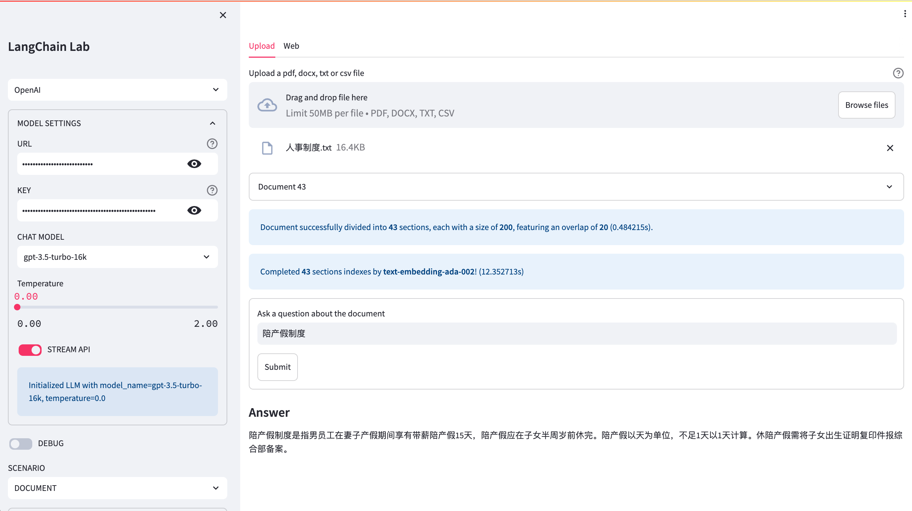

# LangChain LAB | [English](README.md)

这是一个实验项目，用来验证基于 LangChain 的各种大模型使用场景，包括聊天，角色扮演和基于文档的问答。你可以通过可视化的方式设置场景参数，然后在各种大模型上进行测试。

## 前置条件

* python 3.10+
* make

## 快速指南

在项目根目录下创建一个 `.env` 文件，并在文件中配置 OpenAI 的 API Key 和 Model Name 列表。

```text
OPENAI_API_KEY=sk-xxx
OPENAI_API_MODEL_NAMES=gpt-3.5-turbo-16k,gpt-4
```

安装依赖库。

```shell
make install
```

运行项目，执行以下命令后会在浏览器中自动打开界面

```shell
streamlit run main.py
```

## Screenshot





## 环境变量参数

你可以通过环境变量或者 `.env` 文件设置更多的参数

**`DEFAULT_AI_PLATFORM` / `DEFAULT_AI_PLATFORM_SUPPORT`**

你可以通过 `DEFAULT_AI_PLATFORM_SUPPORT` 设置支持的平台，默认值是 `OpenAI`，你可以设置为 `FastChat,OpenAI` 从而开启支持 FastChat 平台的调用。
你可以通过 `DEFAULT_AI_PLATFORM` 参数指定平台下来选择列表中默认的平台名称，默认值是 `OpenAI`

**`OPENAI_API_BASE` / `OPENAI_API_KEY` / `OPENAI_API_MODEL_NAMES`**

你可以通过 `OPENAI_API_KEY` 设置 API KEY。通过设置 `OPENAI_API_BASE` 指定调用地址。通过 `OPENAI_API_MODEL_NAMES` 设置可选模型名称，多个名称逗号分隔，默认是 `gpt-3.5-turbo-16k,gpt-4`。
当然也可以选择不设置这些参数，你可以在启动后的页面中设置。

**`FASTCHAT_API_BASE` / `FASTCHAT_API_KEY` / `FASTCHAT_API_MODEL_NAMES`**

如果你通过 `DEFAULT_AI_PLATFORM_SUPPORT` 开启了 FastChat 平台支持，你可以通过 `FASTCHAT_API_KEY` 设置 API KEY。通过设置 `FASTCHAT_API_BASE` 指定调用地址。通过 `FASTCHAT_API_MODEL_NAMES` 设置可选模型名称。
与 OpenAI 参数一样你也可以选择不设置这些参数，你可以在启动后的页面中设置，但是 `FASTCHAT_API_MODEL_NAMES` 参数必须提供一个可选的模型名称。

**`HUGGINGFACE_CATCH_PATH`**

设置 huggingface 缓存目录，默认值是 `./huggingface`，当你选择非 OpenAI API 时可以选择使用 huggingface 的 EMBED 模型，这些模型首次选择后将下载到这个缓存目录中。目前可选模型如下：

* moka-ai/m3e-base
* sentence-transformers/msmarco-distilbert-base-v4
* shibing624/text2vec-base-chinese
