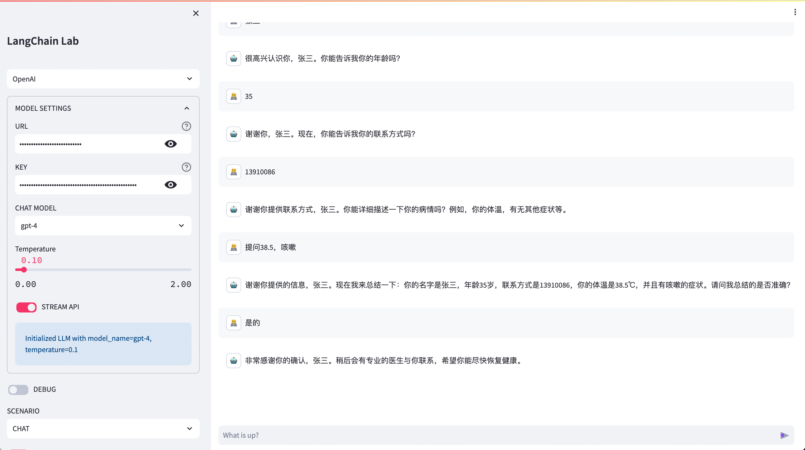

# LangChain LAB | [English](README.md)

这是一个实验项目，用来验证基于 LangChain 的各种大模型使用场景，包括聊天，角色扮演和基于文档的问答。你可以通过可视化的方式设置场景参数，尝试接入OpenAI API 或者兼容 API。

## 前置条件

* python 3.11+
* make
* [poetry](https://python-poetry.org/docs/#installation)

## 快速开始

通过将  langchain-lab 绑定到外部端口 8080 来启动 Docker 容器。

```shell
docker run -d --rm -p 8080:8080 \
-e OPENAI_API_BASE=https://api.openai.com/v1 \
-e OPENAI_API_KEY=sk-xx \
coolbeevip/langchain-lab
```
访问 http://localhost:8080 打开 langchain-lab 界面。

## 开发指南

在项目根目录下创建一个 `.env` 文件，并在文件中配置 OpenAI 的 API Key 和调用地址。

```text
OPENAI_API_BASE=https://api.openai.com/v1
OPENAI_API_KEY=sk-xx
```

安装依赖库。

```shell
make install
```

运行项目，执行以下命令后会在浏览器中自动打开界面

```shell
make run
```

## Screenshot





## 环境变量参数

你可以通过环境变量或者 `.env` 文件设置更多的参数

**`OPENAI_API_BASE` / `OPENAI_API_KEY`**

你可以通过 `OPENAI_API_KEY` 设置 API KEY。通过设置 `OPENAI_API_BASE` 指定调用地址。 当然也可以选择不设置这些参数，你可以在启动后的页面中设置。

**`HUGGINGFACE_CATCH_PATH`**

设置 huggingface 缓存目录，默认值是 `./huggingface`，当你选择兼容 OpenAI API 时可以选择使用 huggingface 的 EMBED 模型，这些模型首次选择后将下载到这个缓存目录中。目前可选模型如下：

* moka-ai/m3e-base
* sentence-transformers/msmarco-distilbert-base-v4
* shibing624/text2vec-base-chinese
